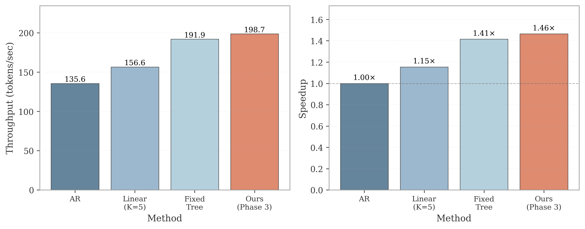

# LLM-Efficient-Reasoning

This repository contains research code and artifacts for **training-free LLM inference acceleration**, centered around **DynaTree** (adaptive tree speculative decoding), plus supporting benchmarks and plotting utilities.

- **Paper (PDF/LaTeX)**: `paper/dynatree.pdf`, `paper/dynatree.tex`
- **Core decoding code**: `spec_decode/` (tree + linear speculative decoding)
- **Benchmarks used to generate results**: `papers/`
- **Plotting scripts (paper figures)**: `plots/`
- **Figures used in the paper/README**: `figures/`

---

## What’s inside

### DynaTree (adaptive tree speculative decoding)
DynaTree is a **training-free** tree-based speculative decoding framework that adaptively controls tree breadth/depth under a strict node budget and pruning, while preserving greedy-decoding exactness.

Implementation lives primarily in:
- `spec_decode/core/tree_speculative_generator_adaptive.py`
- `spec_decode/core/token_tree.py`
- `spec_decode/core/tree_speculative_generator.py` (tree verification utilities)

### KV-cache compression (course project module)
The repo also includes a KV-cache compression library (used for the broader course project scope):
- `kvcompress/` (multiple KV-cache compression strategies and benchmarking utilities)

---

## Repository layout (high-level)

```text
paper/                  NeurIPS-style paper sources + compiled PDF
  dynatree.tex
  dynatree.pdf
  references.bib
spec_decode/             speculative decoding implementations and eval scripts
papers/                  benchmark scripts used to produce JSON logs
plots/                   plotting scripts for paper figures
results/                 logged JSON results (source of truth for numbers/plots)
figures/                 figure assets used by the paper
kvcompress/              KV-cache compression library (course module)
```

---

## Main results (paper Table 1, \(T=1500\))

This table mirrors the **main results table in** `paper/dynatree.tex` (throughput in tokens/s, mean\(\pm\)std over prompts; speedup vs AR). Linear speculation uses **\(K=8\)** on WikiText-2 and **\(K=5\)** on PG-19. The tuned fixed-tree baseline uses **\(D=8\)**, **\(B=3\)**, **\(\tau=0.1\)**.

| Method | WikiText-2 Throughput (tokens/s) | WikiText-2 Speedup | PG-19 Throughput (tokens/s) | PG-19 Speedup |
|---|---:|---:|---:|---:|
| AR | 133.4±0.5 | 1.00× | 114.8±20.6 | 1.00× |
| Linear Spec | 196.1±37.8 | 1.47× | 144.9±28.6 | 1.26× |
| Fixed Tree | 200.7±41.7 | 1.50× | 185.5±33.2 | 1.62× |
| **DynaTree** | **219.5±22.2** | **1.64×** | **194.9±35.6** | **1.70×** |

Figure view:



**Traceability (JSON source files)**:
- WikiText-2 main benchmark: `results/adaptive/main_D8B3/1500/results.json`
- PG-19 main benchmark: `results/adaptive/pg19/pg19_benchmark_D8B3.json`

---

## Environment setup

### Requirements
- Linux + NVIDIA GPU recommended
- Python 3.9+

### Option A: automated setup (recommended)

```bash
chmod +x setup_environment.sh
bash setup_environment.sh
```

This script installs PyTorch (based on your CUDA), installs `requirements.txt`, verifies imports, and creates output folders.

### Option B: manual setup

```bash
# (optional) conda
conda create -n llm-reasoning python=3.11 -y
conda activate llm-reasoning

# install dependencies
pip install -r requirements.txt
```

### Models
Most experiments use:
- Target model: `EleutherAI/pythia-2.8b`
- Draft model: `EleutherAI/pythia-70m`

Check local availability (and print recommended CLI args):

```bash
python check_models.py
```

Optional helper downloads:

```bash
python download_pythia_2.8b.py
python download_pythia_small.py
```

---

## Main experiments (paper protocol)

All commands below run from the repo root (`/root/LLM-Efficient-Reasoning`) and write JSON outputs under `results/`.

### 0) Paper compilation

```bash
cd paper
latexmk -pdf -interaction=nonstopmode -halt-on-error dynatree.tex
```

Output: `paper/dynatree.pdf`

### 1) Main results on WikiText-2 (\(T=1500\))
Generates the WikiText-2 portion of the main table (and intermediate per-method metrics).

```bash
python papers/benchmark_main_D8B3.py \
  --target-model EleutherAI/pythia-2.8b \
  --draft-model EleutherAI/pythia-70m \
  --max-new-tokens 1500 \
  --num-samples 10 \
  --warmup-runs 2 \
  --max-prompt-length 800 \
  --output results/adaptive/main_D8B3/1500/results.json
```

### 2) Main results on PG-19 (\(T=1500\))
Generates the PG-19 portion of the main table.

```bash
python papers/benchmark_adaptive_pg19.py \
  --target-model EleutherAI/pythia-2.8b \
  --draft-model EleutherAI/pythia-70m \
  --max-new-tokens 1500 \
  --num-samples 10 \
  --warmup-runs 2 \
  --max-prompt-length 1000 \
  --pg19-path data/pg19.parquet \
  --output results/adaptive/pg19/pg19_benchmark_D8B3.json
```

### 3) (Optional) All-in-one adaptive benchmark (main + ablation + sensitivity + scalability)

```bash
python papers/benchmark_adaptive_paper.py \
  --target-model EleutherAI/pythia-2.8b \
  --draft-model EleutherAI/pythia-70m \
  --experiment all \
  --max-new-tokens 1000 \
  --num-samples 10 \
  --warmup-runs 2 \
  --max-prompt-length 800 \
  --output results/paper_benchmark.json
```

---

## Plotting (paper figures)

The repository contains two “layers” of plotting:

- **Paper-ready images already committed**: `figures/*.png` / `figures/*.pdf`
- **Plot scripts** (regenerate or customize): `plots/*.py`

Example commands:

```bash
python plots/plot_main_results.py
```

---

## Notes / limitations
- The speculative decoding implementation targets **batch size = 1** (single-request decoding).
- The paper focuses on **greedy decoding** (exact sequence match to the target model’s greedy output).
- Some scripts try to load WikiText-2 via ModelScope; if that fails, they fall back to a built-in prompt list.

---

## License
See `LICENSE`.
