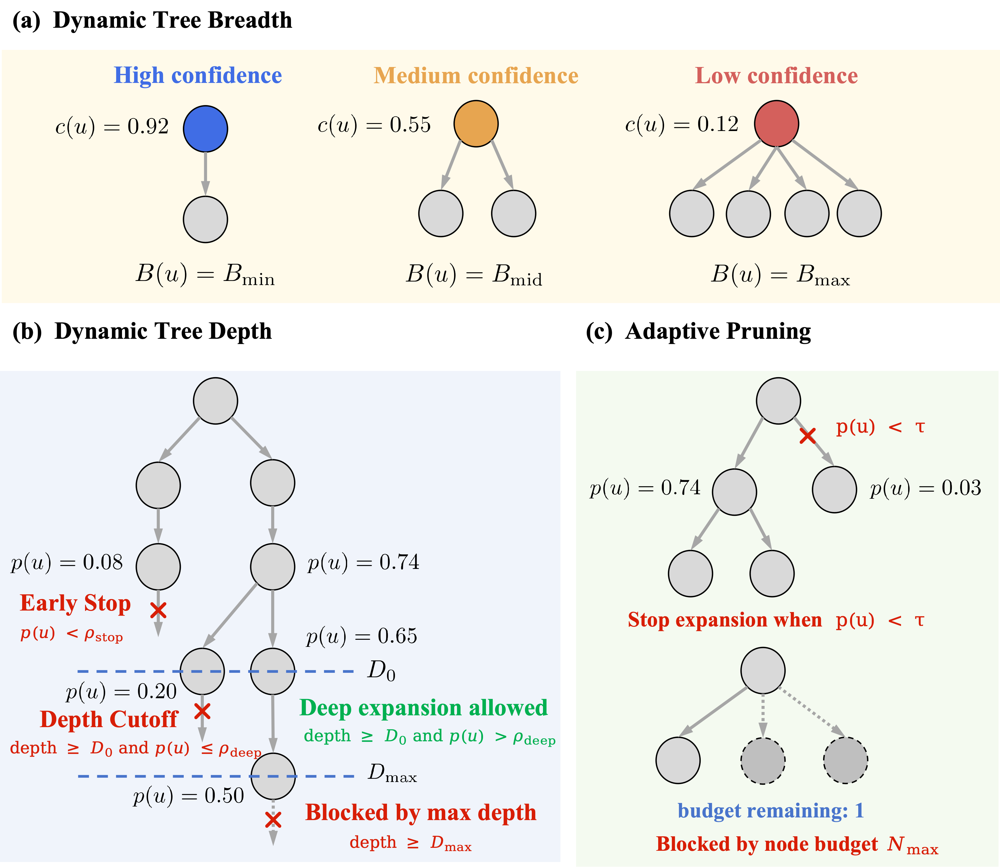
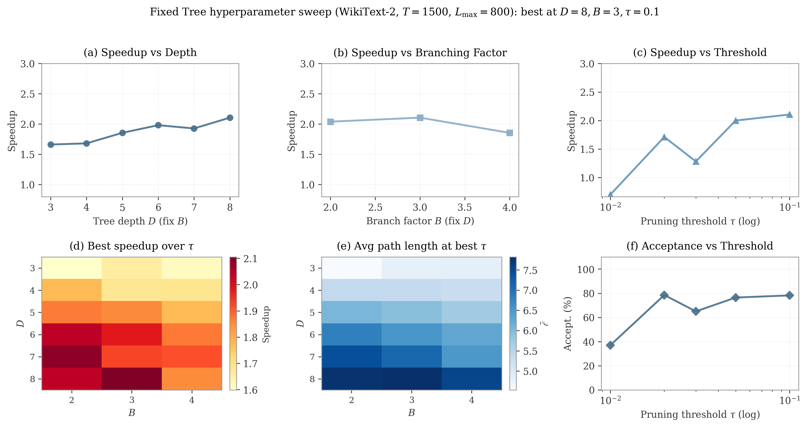

# LLM-Efficient-Reasoning

This repository contains research code and artifacts for **training-free LLM inference acceleration**, centered around **DynaTree** (adaptive tree speculative decoding), plus supporting benchmarks and plotting utilities.

- **Paper (PDF/LaTeX)**: `paper/dynatree.pdf`, `paper/dynatree.tex`
- **Core decoding code**: `spec_decode/` (tree + linear speculative decoding)
- **Benchmarks used to generate results**: `papers/`
- **Plotting scripts (paper figures)**: `plots/`
- **Figures used in the paper/README**: `figures/`

---

## What’s inside

### DynaTree (adaptive tree speculative decoding)
DynaTree is a **training-free** tree-based speculative decoding framework that adaptively controls tree breadth/depth under a strict node budget and pruning, while preserving greedy-decoding exactness.

Implementation lives primarily in:
- `spec_decode/core/tree_speculative_generator_adaptive.py`
- `spec_decode/core/token_tree.py`
- `spec_decode/core/tree_speculative_generator.py` (tree verification utilities)

### KV-cache compression (course project module)
The repo also includes a KV-cache compression library (used for the broader course project scope):
- `kvcompress/` (multiple KV-cache compression strategies and benchmarking utilities)

---

## Repository layout (high-level)

```text
paper/                  NeurIPS-style paper sources + compiled PDF
  dynatree.tex
  dynatree.pdf
  references.bib
spec_decode/             speculative decoding implementations and eval scripts
papers/                  benchmark scripts used to produce JSON logs
plots/                   plotting scripts for paper figures
results/                 logged JSON results (source of truth for numbers/plots)
figures/                 figure assets used by the paper
kvcompress/              KV-cache compression library (course module)
```

---

## Results at a glance (figures)

**Adaptive mechanisms overview (DynaTree):**



**Main results (throughput / speedup):**


**Length scaling:**


**Fixed-tree sweep (paper protocol):**



**Note**: The authoritative numbers come from JSON logs under `results/`. Figures under `figures/` are the rendered plots used for the paper and this README.

---

## Environment setup

### Requirements
- Linux + NVIDIA GPU recommended
- Python 3.9+

### Option A: automated setup (recommended)

```bash
chmod +x setup_environment.sh
bash setup_environment.sh
```

This script installs PyTorch (based on your CUDA), installs `requirements.txt`, verifies imports, and creates output folders.

### Option B: manual setup

```bash
# (optional) conda
conda create -n llm-reasoning python=3.11 -y
conda activate llm-reasoning

# install dependencies
pip install -r requirements.txt
```

### Models
Most experiments use:
- Target model: `EleutherAI/pythia-2.8b`
- Draft model: `EleutherAI/pythia-70m`

Check local availability (and print recommended CLI args):

```bash
python check_models.py
```

Optional helper downloads:

```bash
python download_pythia_2.8b.py
python download_pythia_small.py
```

---

## Main experiments (paper protocol)

All commands below run from the repo root (`/root/LLM-Efficient-Reasoning`) and write JSON outputs under `results/`.

### 0) Paper compilation

```bash
cd paper
latexmk -pdf -interaction=nonstopmode -halt-on-error dynatree.tex
```

Output: `paper/dynatree.pdf`

### 1) Main results (AR vs linear spec vs fixed tree vs adaptive phases)
This is the main benchmark used to generate the paper’s primary comparison under the WikiText-2 protocol.

```bash
python papers/benchmark_main_D8B3.py \
  --target-model EleutherAI/pythia-2.8b \
  --draft-model EleutherAI/pythia-70m \
  --max-new-tokens 1500 \
  --num-samples 10 \
  --warmup-runs 2 \
  --max-prompt-length 800 \
  --output results/adaptive/main_D8B3/results.json
```

### 2) Fixed-tree hyperparameter sweep (strong tuned baseline)
Sweeps \(D, B, \\tau\\) under the same protocol to identify the best fixed-tree configuration.

```bash
python papers/fixed_tree_sweep_paper.py \
  --target-model EleutherAI/pythia-2.8b \
  --draft-model EleutherAI/pythia-70m \
  --output-dir results/adaptive/fixed_tree_sweep \
  --num-prompts 10 \
  --prompt-length 800 \
  --max-new-tokens 1500 \
  --num-runs 2
```

### 3) Pruning ablation (Tree V2: with vs without pruning)

```bash
python papers/benchmark_ablation_pruning.py \
  --target-model EleutherAI/pythia-2.8b \
  --draft-model EleutherAI/pythia-70m \
  --max-new-tokens 500 \
  --num-samples 10 \
  --warmup-runs 2 \
  --max-prompt-length 800 \
  --output results/ablation_pruning_wikitext.json
```

### 4) All-in-one adaptive benchmark (main + ablation + sensitivity + scalability)

```bash
python papers/benchmark_adaptive_paper.py \
  --target-model EleutherAI/pythia-2.8b \
  --draft-model EleutherAI/pythia-70m \
  --experiment all \
  --max-new-tokens 1000 \
  --num-samples 10 \
  --warmup-runs 2 \
  --max-prompt-length 800 \
  --output results/paper_benchmark.json
```

---

## Plotting (paper figures)

The repository contains two “layers” of plotting:

- **Paper-ready images already committed**: `figures/*.png` / `figures/*.pdf`
- **Plot scripts** (regenerate or customize): `plots/*.py`

Example commands:

```bash
python plots/plot_main_results.py
python plots/plot_length_scaling_fourpanel.py
python plots/plot_fixed_tree_sweep.py
```

---

## Notes / limitations
- The speculative decoding implementation targets **batch size = 1** (single-request decoding).
- The paper focuses on **greedy decoding** (exact sequence match to the target model’s greedy output).
- Some scripts try to load WikiText-2 via ModelScope; if that fails, they fall back to a built-in prompt list.

---

## License
See `LICENSE`.
