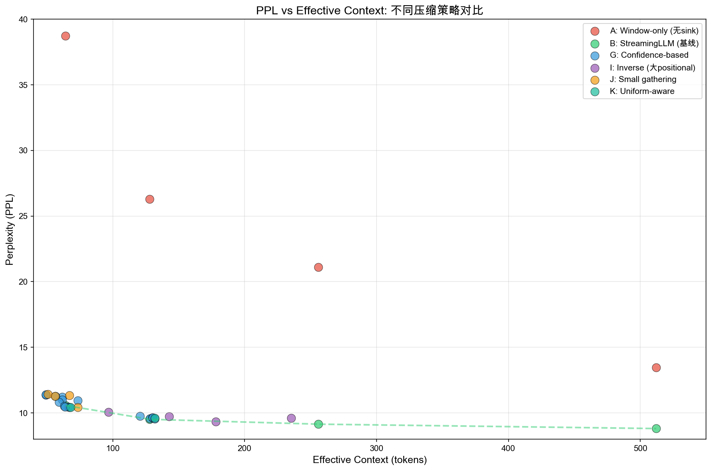
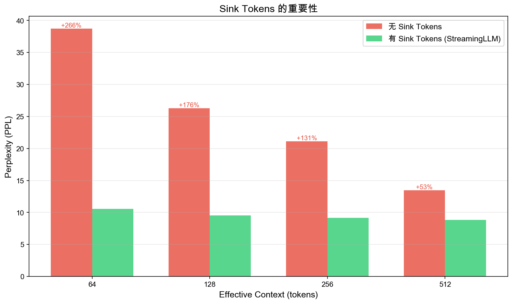
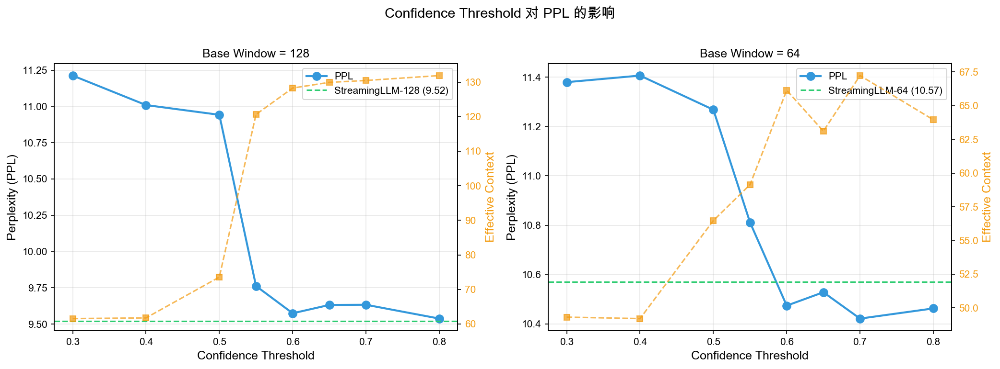
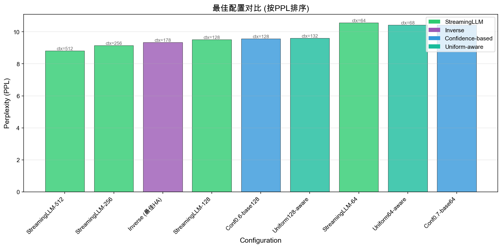
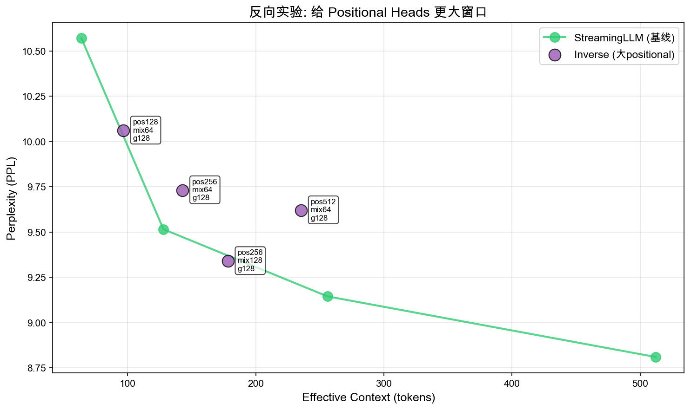

# Head-Aware KV Cache 压缩实验报告

## 1. 研究概述

### 1.1 研究背景

在大型语言模型推理过程中，KV Cache 的内存占用是主要瓶颈之一。StreamingLLM 提出了使用 Sink Tokens + Sliding Window 的方法来限制 KV Cache 大小。本研究探索是否可以通过识别不同注意力头的功能特性，为其分配不同的上下文窗口大小，从而在相同平均上下文长度下获得更好的模型性能。

### 1.2 研究假设

**核心假设**：不同类型的注意力头有不同的上下文需求：
- **Gathering heads** (信息聚合头)：需要访问全局信息，应分配更大窗口
- **Positional heads** (位置编码头)：主要关注局部位置关系，可以使用较小窗口
- **Mixed heads** (混合型头)：介于两者之间

### 1.3 实验模型

- **模型**: EleutherAI/pythia-2.8b
- **架构**: 32层, 每层32个注意力头, 共1024个头
- **评估指标**: Perplexity (PPL), Accuracy, Effective Context

## 2. 注意力头分类分析

### 2.1 分类结果

| 头类型 | 数量 | 占比 | 置信度范围 | 平均置信度 |
|--------|------|------|------------|------------|
| **Gathering** | 88 | 8.6% | 0.011 - 0.590 | 0.255 |
| **Mixed** | 566 | 55.3% | 0.500 - 0.500 | 0.500 |
| **Positional** | 370 | 36.1% | 0.025 - 1.000 | 0.509 |

### 2.2 关键发现：分类置信度问题

**重要发现**：分类结果存在严重的置信度问题：

1. **Mixed heads (55.3%)**: 所有566个头的置信度都是 **0.500**，意味着分类器完全不确定
2. **Gathering heads (8.6%)**: 平均置信度仅 0.255，最高也只有 0.590
3. **Positional heads (36.1%)**: 只有34个头 (3.3%) 的置信度 ≥ 0.6

这意味着超过一半的头无法被可靠分类，这对后续的 head-aware 策略产生了重大影响。

## 3. 实验设计

### 3.1 实验组设置

| 组别 | 名称 | 策略 | 目的 |
|------|------|------|------|
| **A** | Window-only | 纯滑动窗口，无sink | 验证sink tokens重要性 |
| **B** | StreamingLLM | sink=4 + window | 主对照基线 |
| **G** | Confidence-based | 基于置信度分配窗口 | 测试置信度阈值影响 |
| **I** | Inverse | positional大窗口 | 反向假设验证 |
| **J** | Small-gathering | 限制gathering窗口 | 测试gathering真实需求 |
| **K** | Uniform-aware | 所有类型相同窗口 | 验证per-layer机制 |

### 3.2 具体配置

**G组 (Confidence-based)**:
- 置信度阈值: 0.3, 0.4, 0.5, 0.55, 0.6, 0.65, 0.7, 0.8
- 基础窗口: 64, 128
- 高置信度窗口: positional=16, mixed=64, gathering=256

**I组 (Inverse)**:
- positional: 128, 256, 512 (比传统方法更大)
- mixed: 64, 128
- gathering: 128 (比传统方法更小)

## 4. 实验结果

### 4.1 主要结果汇总

#### 控制组对比 (Sink Tokens 重要性)

| 配置 | PPL | Accuracy | Eff.Ctx |
|------|-----|----------|---------|
| A_window_512 (无sink) | 13.47 | 47.85% | 512 |
| **B_streaming_512** | **8.81** | **52.45%** | 512 |
| A_window_128 (无sink) | 26.28 | 40.94% | 128 |
| **B_streaming_128** | **9.52** | **52.05%** | 128 |
| A_window_64 (无sink) | 38.72 | 36.04% | 64 |
| **B_streaming_64** | **10.57** | **51.05%** | 64 |

**结论**: Sink tokens 至关重要，缺少它们会导致 PPL 增加 53%-266%。

#### ~64 Context 范围对比

| 配置 | PPL | Accuracy | Eff.Ctx | vs B_streaming_64 |
|------|-----|----------|---------|-------------------|
| **K_uniform64_aware** | **10.42** | 50.75% | 68.0 | **-1.4%** ✓ |
| **G_conf0.7_base64** | **10.42** | 51.05% | 67.2 | **-1.4%** ✓ |
| G_conf0.6_base64 | 10.47 | 50.65% | 66.1 | -0.9% |
| J_pos64_mix64_g128 | 10.43 | 51.45% | 73.5 | -1.3% |
| **B_streaming_64** | **10.57** | **51.05%** | **64.0** | baseline |

**结论**: 在小 context 场景下，Head-aware 方法可以超越 StreamingLLM！

#### ~128 Context 范围对比

| 配置 | PPL | Accuracy | Eff.Ctx | vs B_streaming_128 |
|------|-----|----------|---------|-------------------|
| **B_streaming_128** | **9.52** | **52.05%** | **128.0** | baseline |
| G_conf0.8_base128 | 9.54 | 51.35% | 131.9 | +0.2% |
| G_conf0.6_base128 | 9.57 | 51.85% | 128.3 | +0.5% |
| K_uniform128_aware | 9.60 | 52.45% | 132.0 | +0.8% |
| G_conf0.55_base128 | 9.76 | 52.25% | 120.6 | +2.5% |

**结论**: 在中等 context 场景，StreamingLLM 仍然略优，但差距很小。

#### 反向实验 (I组) 结果

| 配置 | PPL | Accuracy | Eff.Ctx | 说明 |
|------|-----|----------|---------|------|
| **I_pos256_mix128_g128** | **9.34** | **52.55%** | 178.2 | 最佳head-aware |
| I_pos512_mix64_g128 | 9.62 | 52.15% | 235.4 | |
| I_pos256_mix64_g128 | 9.73 | 52.45% | 142.9 | |
| B_streaming_256 | 9.14 | 51.95% | 256.0 | 对照 |

**关键发现**: 
- `I_pos256_mix128_g128` (PPL=9.34) 比 `B_streaming_128` (PPL=9.52) **好1.9%**
- 给 positional heads 更大窗口反而效果更好！

### 4.2 最佳配置

| 排名 | 配置 | PPL | Ctx | 特点 |
|------|------|-----|-----|------|
| 1 | B_streaming_512 | 8.81 | 512 | 最低PPL |
| 2 | B_streaming_256 | 9.14 | 256 | |
| 3 | **I_pos256_mix128_g128** | **9.34** | 178 | **最佳head-aware** |
| 4 | B_streaming_128 | 9.52 | 128 | |
| 5 | G_conf0.8_base128 | 9.54 | 132 | 接近StreamingLLM |

## 5. 深度分析

### 5.1 为什么传统 Head-Aware 策略失败？

传统策略假设：positional heads 需要小窗口，gathering heads 需要大窗口。

**失败原因**:

1. **分类不可靠**: 55% 的 heads (mixed) 置信度只有 0.5，无法可靠区分
2. **假设可能错误**: 反向实验表明 positional heads 可能需要更大窗口
3. **上下文分布不均**: 传统策略导致部分 heads 被过度限制

### 5.2 为什么反向策略 (I组) 效果好？

`I_pos256_mix128_g128` 的配置：
- positional: 256 (大)
- mixed: 128 (中)
- gathering: 128 (限制)

**可能解释**:
1. **Positional heads 需要足够上下文来建立位置关系**
2. **Gathering heads 数量少 (8.6%)，限制它们影响有限**
3. **更均匀的上下文分布有利于层间信息传递**

### 5.3 Confidence-based 策略的价值

高置信度阈值 (≥0.6) 的策略接近 StreamingLLM：
- 只有 34 个 heads (3.3%) 被"特殊处理"
- 其余 990 个 heads 使用 base_window
- 本质上是 "StreamingLLM + 微调"

**启示**: 当分类不可靠时，保守策略是明智的。

### 5.4 小 Context 场景的优势

在 ctx ≈ 64 时，head-aware 超越 StreamingLLM 的原因：
- 小窗口下，不同 heads 的差异化处理收益更明显
- Sink tokens 的相对比例更高 (4/64 = 6.25%)

## 6. 结论与建议

### 6.1 核心结论

1. **Sink Tokens 必不可少**: 缺失会导致 PPL 灾难性增加
2. **传统 Head-Aware 假设可能错误**: Positional heads 可能需要更大而非更小的窗口
3. **小 Context 场景有机会**: Head-aware 在 ctx ≤ 80 时可以超越 StreamingLLM
4. **分类置信度是关键**: 当分类不可靠时，uniform 策略更安全

### 6.2 实践建议

| Context 范围 | 推荐策略 | 配置 |
|-------------|---------|------|
| ≤ 80 | K_uniform_aware 或 G_conf0.7_base64 | pos=mix=g=64 |
| 80-150 | I_pos256_mix128_g128 | 反向配置 |
| > 150 | StreamingLLM | sink=4, window=ctx-4 |

### 6.3 未来方向

1. **改进分类方法**: 当前基于熵的分类置信度太低
2. **学习型窗口分配**: 使用可学习的方式为每个 head 分配窗口
3. **更大模型验证**: Head 特化在更大模型中可能更明显
4. **动态窗口**: 根据输入动态调整窗口大小

## 7. 可视化结果

### 7.1 PPL vs Effective Context



**图表解读**:
- 红色 (A组): 无 sink tokens，PPL 极高
- 绿色 (B组): StreamingLLM 基线
- 蓝色 (G组): Confidence-based 策略
- 紫色 (I组): 反向实验（大positional窗口）
- 青色 (K组): Uniform-aware

### 7.2 Sink Tokens 重要性



**关键发现**: 缺少 sink tokens 会导致 PPL 增加 53%-266%。

### 7.3 Confidence Threshold 影响



**观察**:
- 左图 (base=128): 高阈值 (≥0.6) 接近 StreamingLLM
- 右图 (base=64): 高阈值可以超越 StreamingLLM

### 7.4 最佳配置对比



### 7.5 反向实验结果



**关键发现**: 给 positional heads 更大窗口 (256) 反而获得更好效果！

## 8. 附录

### 8.1 完整实验数据

详见:
- `results/ablation_study/ablation_final.json`
- `results/ablation_study/ablation_final_2.json`

### 8.2 可视化脚本

```bash
# 生成所有图表
python scripts/plot_ablation_results.py \
    --input results/ablation_study/ablation_final_2.json \
           results/ablation_study/ablation_final.json \
    --output results/ablation_study/figures/
```

### 8.3 实验重现

```bash
# 运行消融实验
python scripts/ablation_final.py \
    --model EleutherAI/pythia-2.8b \
    --classifications results/attention_analysis_pythia-2.8b/head_classifications.json \
    --max-tokens 1000 \
    --output results/ablation_study/
```

---

*实验在 RTX 5090 (32GB) 上进行*
*模型: EleutherAI/pythia-2.8b*
*评估 tokens: 1000*
*报告生成日期: 2024年12月*

